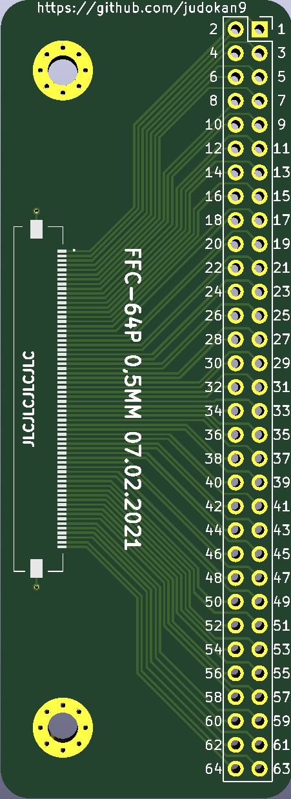
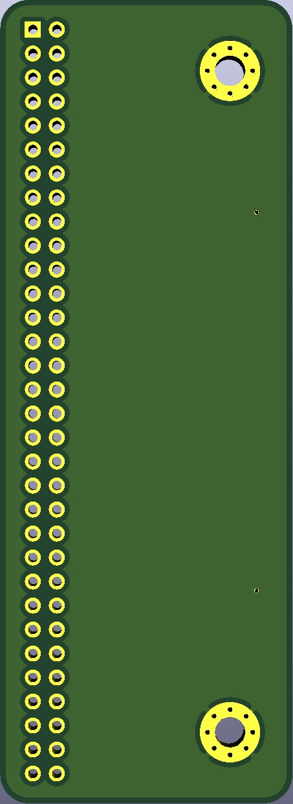

# FFC-FPC-64pin-breakout
This is just a simple FFC/FPC 64pin breakout board using the Molex 502790-6491

This could also be adapted to use one of the following connectors:
* Hirose FH52E-64S-0.5SH(99)
* KYOCERA 046288064000846+
* KYOCERA 046288064600846+

  
  

